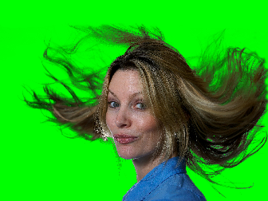
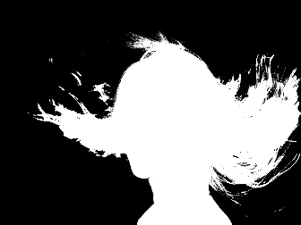
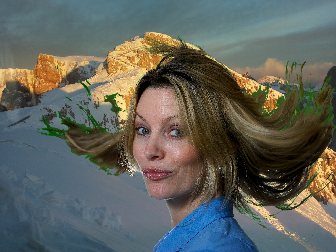

## Example Applications

Two sample applications are provided.

### processImage

This application is meant to help debugging the algorithm. 
It takes as input an image and shows the results of the different part of the algorithm.
It shows the computed mask image and the final blending with a given background image (optional).

```bash
processImage <image> [<background image>]
```

For example, calling:

```bash
processImage data/testData/ck4.jpg data/testData/background.jpg
```

it shows three windows:

1. the original image
  
  
2. the computed mask
  
  
3. the final blended image
    


### processVideo

This application is meant to showcase the algorithm with a live or a video feed. 
It takes as input the video or a camera index and it computes the chromakey segmentation.
If a background image is also given, it is blended in the image.

```bash
processVideo <videoFile or cameraIndex> [<background image>]
```

where:

* `videoFile` can be any video file

* `cameraIndex` is an integer usually in `[0-9]` to select the camera to use